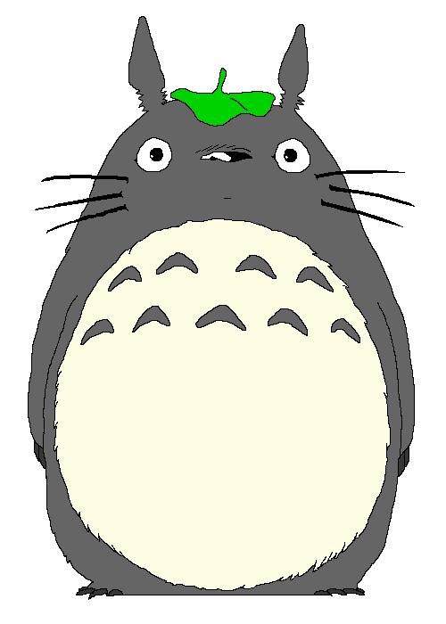
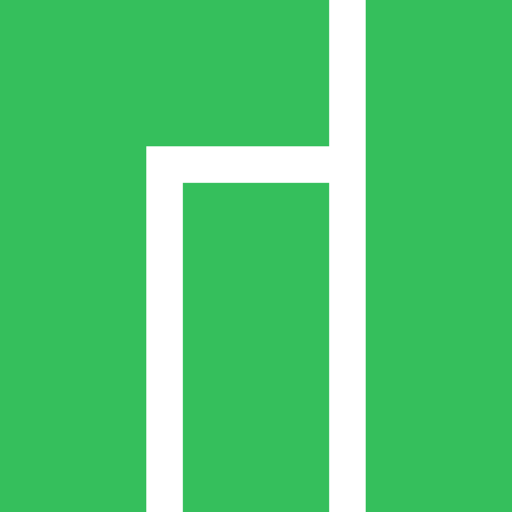
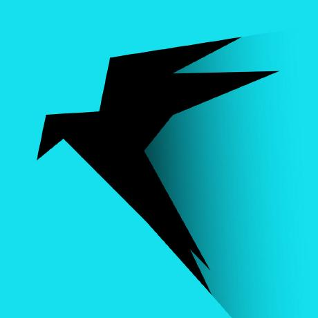

<!--  -->

Hi, I'm Harold Eustaquio, a freelance developer with more than 3 years of experience in software development. I have been working as a freelance developer since 2018 and have gained expertise in a wide range of programming languages including C, C++, PHP, Typescript, Java, and Python. Apart from my programming skills, I also have experience in various frameworks such as Laravel, Vue.JS, Express.JS, Fastify.JS, Nest.JS and Flask. These frameworks have helped me to develop scalable applications for my clients.

Before diving into the world of software development, I also worked in customer service for a year, which has given me excellent communication and problem-solving skills. Additionally, I worked as a tech support, where I was responsible for helping clients with various technical issues.

In my free time, I love to explore new technologies and experiment with different programming languages to improve my skills. My passion for coding drives me to deliver high-quality software solutions that meet my clients' requirements and exceed their expectations.

If you are looking for a dedicated and experienced freelance developer to build your next project, I would love to collaborate with you.

  

   

**TECHNOLOGIES**

<!--  -->

  
  
  
  
  
  
  
  
  
  
  

  
  
  
  
  
  
  
  
  
  
  

  
  
  
  
  
  
  
  
  
  
  

**LINUX**

  
  
  
  
  
  
  
  
  
  
  

**NETWORK & SECURITY**

  
  
  
  
  
  

<table>
  <tr>
    <td valign="top">
      
      
    </td>
    <td valign="top">
      
      
    </td>
  </tr>
<tr>
	<td colspan=2>
		
	</td>
</tr>
</table>

  

    
    
    

 

